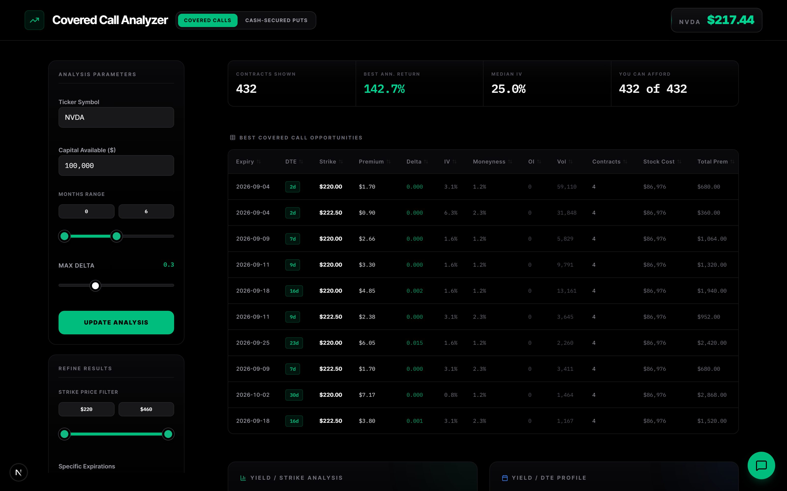
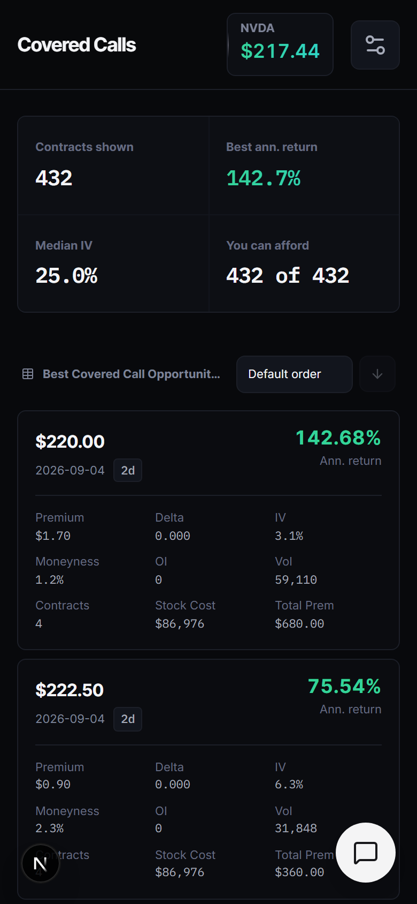

# Option Income Screener

A screener for two option-selling strategies — **covered calls** and **cash-secured
puts** — over live Yahoo Finance option chains. Enter a ticker and how much capital
you have, and it ranks every contract in the chain by annualized return, with delta,
implied volatility, moneyness, open interest and volume alongside.

Built for someone who already knows what a covered call is and wants to stop doing
the arithmetic by hand: which strike, which expiry, and what it actually yields
against the capital it ties up.



<p align="center">
  
</p>

> **This is not financial advice.** It is a calculator over public market data. The
> figures are estimates from delayed quotes and an approximation of delta; they are
> not a recommendation to trade anything. Options can lose money, including more than
> the premium collected. Verify everything with your broker before acting on it.

## The two strategies

Both sell an option and collect the premium. They differ in what secures the trade,
which is what makes their capital requirements different:

| | Covered call | Cash-secured put |
|---|---|---|
| You sell | a call | a put |
| Secured by | 100 shares you own | cash to buy 100 shares |
| **Capital per contract** | **spot price × 100** | **strike × 100** |
| Same for every strike? | yes — it is the cost of the shares | no — it scales with the strike |
| Contracts shown | the whole chain | out-of-the-money only |
| Delta window | `0` to `+limit` | `−limit` to `0` |

That capital difference matters more than it looks. With NVDA at $217.44, *every*
covered call needs $21,744 to secure, whether you sell the $220 strike or the $400
one. A cash-secured put at the $150 strike needs $15,000; at the $200 strike, $20,000.
So the same account affords a different number of contracts depending on the strike
only in the put case.

Delta is entered as a positive magnitude in the UI (`0.3` means "a 30 delta"). The
strategy applies the sign — call deltas are positive, put deltas negative — so you
never type a minus sign.

## Running it

Requires Node 20+.

```bash
npm install
npm run dev
```

Then open http://localhost:3000.

### GROQ_API_KEY

The app has an optional AI assistant that drives the filters by tool calling. It needs
a free [Groq](https://console.groq.com/keys) API key:

```bash
cp .env.example .env.local
```

then put your key in `.env.local`:

```
GROQ_API_KEY=gsk_your_key_here
```

**The key is optional.** Without it the screener, filters, sorting and charts all work
normally; the assistant returns a clear message saying it is unavailable rather than
failing with a provider error. The screener is the product; the assistant is a
convenience on top of it.

### Tests

```bash
npm test
```

115 tests covering the pure logic — the Black-Scholes helpers, the return and
annualization math, the filter evaluator and both strategy modules. For a coverage
report:

```bash
npm run test:coverage
```

### Evaluating the assistant

The assistant is measured, not guessed at. `evals/` holds 66 natural-language
cases across eight categories, and the harness reports how often the model emits
the right tool call:

```bash
npm run eval
```

```bash
npm run eval -- --filter filter
```

```bash
npm run eval -- --case sort-cheapest-first
```

The harness imports the same tools and system prompt the API route uses
(`src/lib/assistant/`), so it cannot drift from what ships. Cases are data in
`evals/cases.json` — adding one does not mean touching the runner. Every emitted
call is validated against the real Zod schema, and the report separates
`correct`, `wrong` and `rejected-by-schema`, because for an adversarial case a
schema rejection is a pass and everywhere else it is a failure. Full runs are
written to `evals/results/<timestamp>.json` so two runs can be compared.

It needs `GROQ_API_KEY`, calls no market-data API, and is paced to Groq's free
tier of 8,000 tokens per minute — every call carries the whole tool schema, so
that budget, not latency, sets the pace. Raise it with `--tpm` on a paid tier.

### Build

```bash
npm run build
```

## How it works

```
ticker ─> Yahoo quote (spot price + company name)
       ─> every expiration Yahoo lists, fetched in parallel
       ─> calls AND puts, trimmed to the fields the screener reads
                │
                ▼  ONE request per ticker. Everything below is local.
                │
       months range narrows the expirations
       strategy picks a side of the chain (calls or puts)
       strategy decides eligibility (cash-secured puts: OTM only)
                │
                ▼
       delta = Black-Scholes on (spot, strike, time, IV, 5% risk-free rate)
       drop anything outside the strategy's delta window
                │
                ▼
       premium  = bid, else mid, else last trade
       capital  = strategy's per-contract requirement
       return   = premium per contract / capital per contract
       annual   = return * 365 / days to expiration
                │
                ▼
       sorted by annualized return ─> table + scatter charts
                                   ─> client-side filters (strike, expiry, assistant)
```

**Yahoo is hit once per ticker.** The board for a symbol — both sides, every
expiration — is fetched in one request and then filtered in the browser. Capital,
delta, the months range, the strike range and the strategy switch are all pure
functions of that payload, so none of them costs a round trip. Changing the delta
slider used to refetch a dozen option chains; now it is arithmetic over data
already in memory.

**Premiums use the bid when it is available**, falling back to the mid of bid/ask and
then to the last trade. The bid is what a seller can actually hit right now; the last
trade may be stale or from the other side of a wide spread, which flatters thin
strikes.

**Returns are per contract.** A contract's yield is a property of the contract, not of
your account — premium collected over capital secured. How many contracts you can
afford is reported separately (the `Contracts` column, and the totals beside it). If
your capital does not cover even one, the screener says so plainly and still shows the
real returns rather than a table of zeros.

### The assistant

The chat assistant calls tools rather than answering in prose: set the ticker, capital,
months range, delta limit, strike range; sort a column; add a filter. Tool calls run in
the browser against the already-fetched chain.

Filters are **structured data, not code**. The model emits conditions like:

```json
{ "field": "iv", "op": "gt", "value": [50] }
```

where `field` is an enum of the numeric columns and `op` is one of `gt`, `gte`, `lt`,
`lte`, `eq`, `between`. The app evaluates that structure itself. Anything failing
validation is rejected and shown as a warning in the chat, with the reason, so the
model can correct itself. There is no `eval` and no `new Function` anywhere in the
codebase.

## Adding a strategy

Strategy differences live in `src/lib/strategies/`. A new one is a new file
implementing `StrategyDefinition` plus one line in the registry — no new branches in
the API route or the page:

```ts
export const cashSecuredCall: StrategyDefinition = {
  id: 'cash-secured-call',
  chainSide: 'calls',
  capitalRequiredPerContract: (quote, spot) => /* ... */,
  delta: calculateCallDelta,
  isEligible: (quote, spot) => quote.strike > spot,
  deltaWindow: (magnitude) => [0, Math.abs(magnitude)],
  defaults: { /* ... */ },
  copy: { /* ... */ },
};
```

## Layout

```
src/
  app/
    page.tsx              screener UI
    api/chain/route.ts    fetch the whole board for one ticker, once
    api/chat/route.ts     assistant tool definitions
  components/
    LLMChatbot.tsx        chat panel; executes tool calls client-side
  lib/
    math.ts               normCdf, call/put delta, formatters
    returns.ts            premium, return, annualization, affordability
    screen.ts             pure screening pipeline (no network)
    filters.ts            structured filter schema + evaluator
    optionChain.ts        option chain and screened-row types
    strategies/           one file per strategy + registry
    assistant/            tools + system prompt, shared with the eval harness
evals/
  cases.json              the eval cases, as data
  run.ts                  the runner (npm run eval)
  grade.ts                the grader
```

## Stack

Next.js 16 (App Router) · React 19 · TypeScript · Tailwind 4 · Vercel AI SDK v4
against Groq · zod · yahoo-finance2 · Recharts · Vitest
